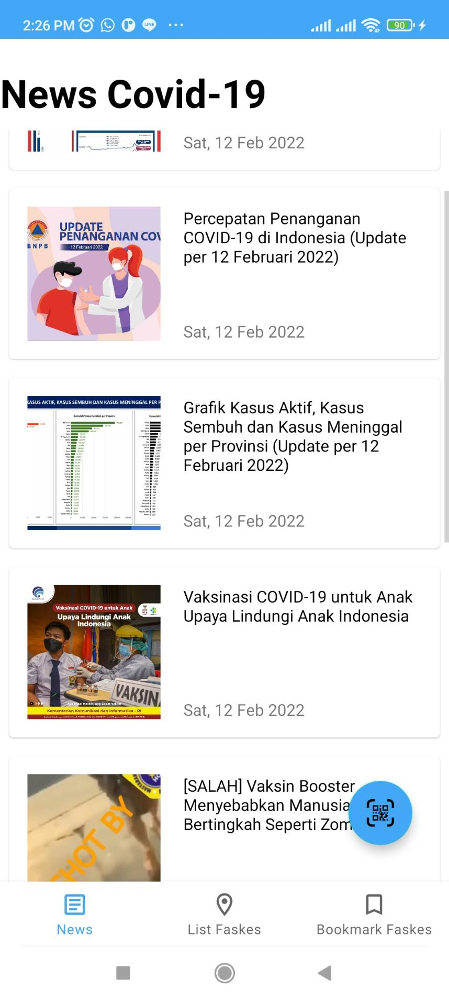
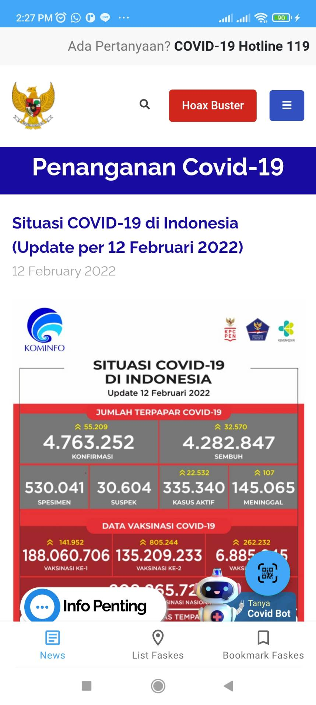
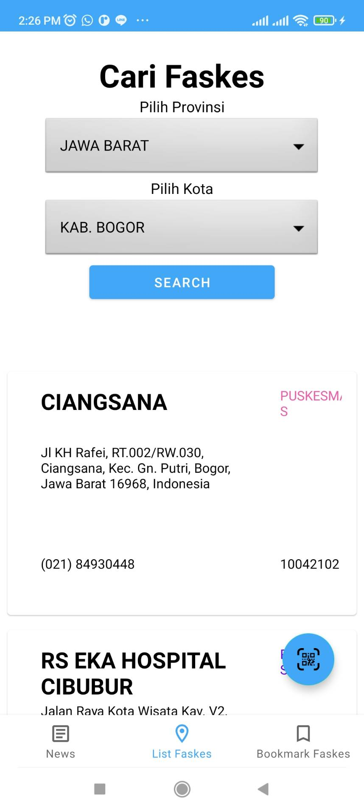
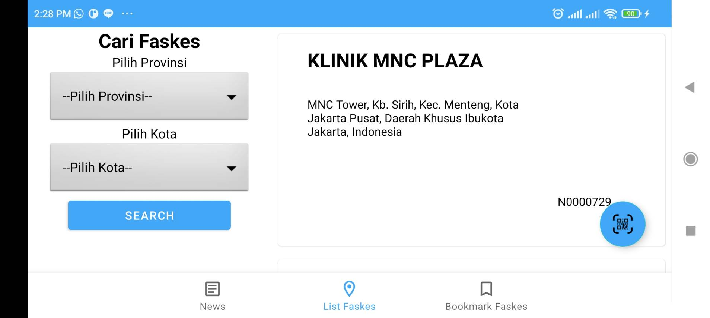
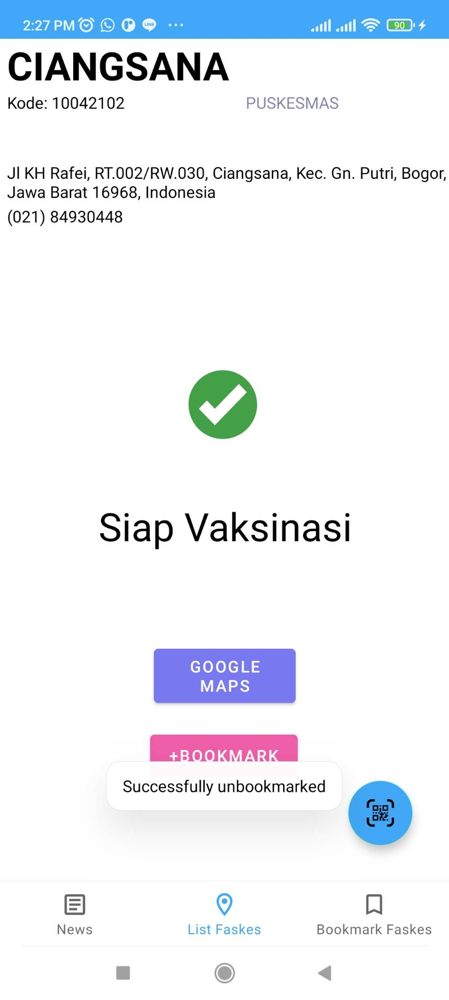
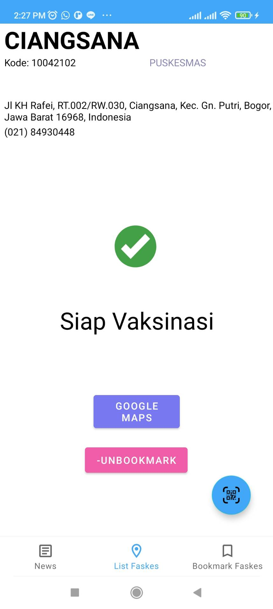
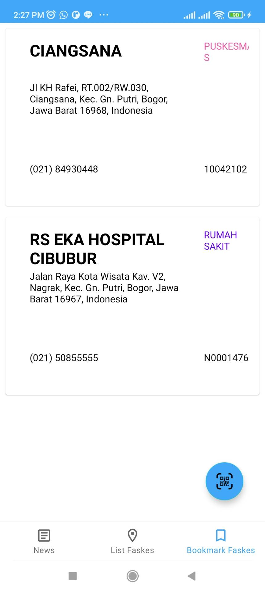
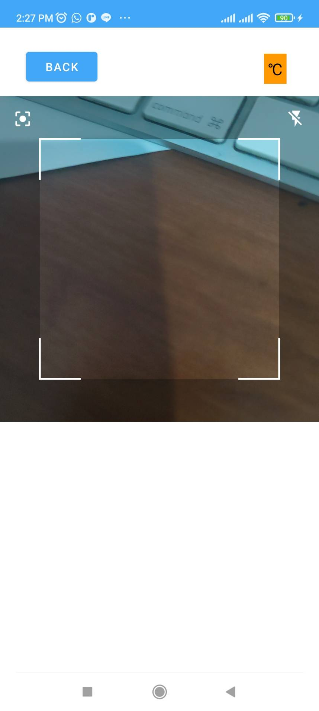

# IF3210-2022-Android-36

## Tugas Besar 1 PBD Kelompok 36

### Deskripsi

Aplikasi ini merupakan aplikasi android yang bernama Perlu Dilindungi. Aplikasi ini merupakan sebuah aplikasi yang memfasilitasi keperluan dan kebutuhan yang berkaitan dengan pandemi COVID-19.

### Cara Kerja
1. Ketika masuk, pengguna akan disuguhi splash screen bertuliskan perlu dilindungi
2. Sesampainya pada bagian utama aplikasi, terdapat bottom navigation bar berisi 3 icon
3. Di dalam aplikasi juga terdapat sebuah tombol yang melayang (floating button)
4. Pada bagian berita, pengguna dapat melihat berita apa saja yang ada terkait pandemi COVID-19, pengguna dapat tap berita yang hendak dibaca. Setelah itu akan muncul tampilan webview dari laman yang dibaca
5. Pada bagian lokasi vaksinasi, pada penggunaan pertama, aplikasi akan meminta untuk mengakses fitur lokasi. Pengguna dapat melakukan searching pada bagian tersebut. Pengguna dapat memilih provinsi dan kota/kabupaten kemudian tap tombol search. Aplikasi akan menampilkan 5 fasilitas kesehatan yang terdekat dari lokasi pengguna.
6. Pengguna dapat tap pilihan fasilitas kesehatan di bagian search tadi, kemudian pengguna akan dirahkan ke detail fasilitas kesehatan yang dipilih. Terdapat bebagai data dari fasilitas kesehatan tersebut. Pengguna bisa melakukan bookmark atau bisa tap tombol google maps untuk melihat lokasi fasilitas kesehatan di google maps.
7. Pada bagian daftar bookmark, pengguna dapat melihat seluruh daftar fasilitas kesehatan yang telah dibookmark. Pengguna dapat tap card dari fasilitas kesehatan tersebut dan akan diarahkan ke bagian detail fasilitas kesehatan yang dipilih.
8. Pada bagian QR Scanner yang diakses dengan cara tap floating button, pengguna dapat scan kode QR dan pengguna akan melakukan "check-in". Di dalamnya, terdapat info sushu kamar di sekitar pengguna jika terdapat sensor suhu pada device yang digunakan, jika tidak maka tidak akan ada informasi suhunya.

### Library Yang Digunakan
1. Retrofit Service 

Library retrofit digunakan untuk mengambil data news COVID-19 dari API. Library ini juga telah meng-handle parsing terhadap response dari API sehingga mudah untuk digunakan. Library ini juga akan mengubah response API yang diperoleh menjadi object sesuai dengan data class yang telah didefinisikan

2. Room 

Library room menfasilitasi developer untuk mengakses database SQLite dengan mudah. Room juga bersifat ORM sehingga developer bisa memperoleh hasil query berbentuk objek yang mudah untuk digunakan

3. Code scanner 

Source : [https://github.com/yuriy-budiyev/code-scanner]
Library code scanner memberikan fitur scan untuk QR code sehingga tidak perlu lagi mengimplementasikan algoritma untuk melakukan scan terhadap QR code. Library ini juga menyediakan akses terhadap fitur kamera seperti tombol fokus dan tombol flash.     

4. Google Play Location Service

Library ini berfungsi untuk memberikan posisi latitude dan longitude dari device. Library ini dipilih karena memiliki akurasi lebih tinggi dibandingkan library location yang merupakan bawaan Android. Library ini digunakan saat pengguna melakukan check in dan ketika pengguna mencari faskes terdekat.

### Screenshot Aplikasi

### Pembagian Kerja

13519061 : Detail, Search Faskes, Bookmark, Navbar, Layout,  GMaps Intent

13519081 : News, Faskes Fragment, Bookmark Page, Retrofit, Room

13519099 : CheckIn, Temperature, Floating Button, QR Scanner
